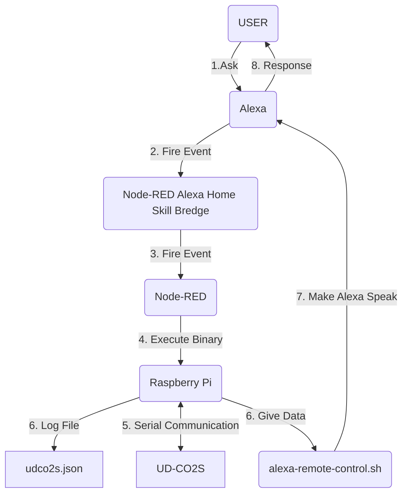

# ud-co2s-with-raspberry-pi-and-alexa
UD-CO2SをRaspberry Piに挿している状態で、Alexaで現在の値を確認できるようにするためのRustスクリプト

## 注意
https://scrapbox.io/oquno/UD-CO2S や https://gist.github.com/oquno/d07f6dbf8cc760f2534d9914efe79801 を参考にしましたが、正直理解の程度は低いです。<br>
お試しになる際は、ライセンスにある通り、自己責任でお願いします。<br>
また、自分の環境はRaspberry Pi 4なのでそれ以下の環境では動作するか不明です。<br>

## 関係図


## 前提となる環境
Rustによるコンパイルが可能な環境が必要です(`rustc -V`や`cargo -V`で確認できます)。<br>
以下では、[alexa-remote-control.sh](https://github.com/thorsten-gehrig/alexa-remote-control)と[Node-Red](https://nodered.org),[Node-RED Alexa Home Skill Bredge](https://alexa-node-red.bm.hardill.me.uk)を使う想定なので、それぞれ[ここ](#参考になるサイト等)を参考にしながら最低限動かせるようにはしてください。<br>
また、現在alexa-remote-controlを少なくとも日本で使うには、[alexa-cookie-cli](https://github.com/adn77/alexa-cookie-cli)でREFRESH_TOKENを取得して、alexa-remote-controlの認証でREFRESH_TOKENを使わないとダメなようです。<br>
また、少なくとも自分の環境のラズパイではREFRESH_TOKENの取得ができなかったので、windowsでalexa-cookie-cliを動かして取得しました。<br>
以上をまとめると、[関係図](#関係図)の1,2,3,4と7,8が正常に動く環境が必要になります。

### 参考になるサイト
Node-RED関係
- https://qiita.com/g-iki/items/a5d4d4674a30de7ed124
- https://qiita.com/loach/items/782dec67962e4085e387

alexa-remote-control
- https://gadget-live.net/raspberry-pi-alexa-remote-control/

alexa-remote-controlでREFRESH_TOKENを使う方法
- https://azzo-q.hatenablog.com/entry/2023/02/19/104638
- https://qiita.com/kenma/items/c56e2e0407ca0d8d3439#echo-dot%E3%81%AB%E8%A9%B1%E3%81%95%E3%81%9B%E3%82%8B

## 設定方法
ラズパイとUD-CO2Sを接続してください。
```bash
$ git clone https://github.com/rakkyo150/ud-co2s-with-raspberry-pi-and-alexa
$ cd ud-co2s-with-raspberry-pi-and-alexa
# LOG_FILE_PATH,ALEXA_REMOTE_CONTROL_SH_PATH,YOUR_ALEXA_DEVICE_NAMEの書き換え
$ vim ./src/main.rs
# ビルド＆テスト
$ cargo run
```
src/main.rsのLOG_FILE_PATH,ALEXA_REMOTE_CONTROL_SH_PATH,YOUR_ALEXA_DEVICE_NAMEを入力済みの例を参考にして書き換えてください。<br>
その際、絶対パスにしましょう。<br>
最後に、`cargo run`でアレクサが現在の酸素濃度をしゃべってくれれば、[関係図](#関係図)の5,6,7,8までは問題ないということです。<br>
ここまで終わったら、つぎはNode-RED関係の設定になります。

Node-RED関係の設定の基本は[このページの方法](https://qiita.com/g-iki/items/a5d4d4674a30de7ed124)になります。<br>
ただし、デバイスの登録では`on`にだけマークすればよく、switchノードは`is true`だけで十分です。<br>
そして、execノードの`コマンド`には、実行ファイルである`ud-co2s-with-raspberry-pi-and-alexa/target/debug/ud-co2s`を絶対パスで指定してあげればOKです。

例：`/home/user`で`git clone`を行った場合は、`/home/user/ud-co2s-with-raspberry-pi-and-alexa/target/debug/ud-co2s`を`コマンド`に入力

以上で設定は終了です。<br>


## 技術選定の理由
そもそも、UD-CO2Sを買ったのは安かったからで、実は酸素濃度の管理をバリバリしたいわけではありませんでした。<br>
そのため、わずわざ数値の確認のために液晶画面を買うのは避けたかったです。<br>
そこで、Alexaに聞いたら分かるようにするのがちょうどいいと判断しました。

Rustの採用理由は、Rustを使ってみたかったのと、できるだけRaspberry Piの負荷を減らしたかったためです。<br>
要は趣味と実益ですね。

Alexaからラズパイへのイベント発火方法にNode-REDを使ったのは、もともと他の用途で既に使用していたので、勝手がわかっているのでやりやすく、Node-REDに集約できるのも魅力的でした。

Alexaに話させる方法としては、Alexaアカウントの認証の仕様変更の影響のためか[Node-RED経由で話させる方法](https://dream-soft.mydns.jp/blog/developper/smarthome/2020/09/2049/)は上手く動かず断念しました。<br>
(少なくとも自分の環境では、)alexa-remote-controlがREFRESH_TOKENを使う方法でしか動かなかったのもこのためだと思われます。<br>
実際に、現時点ではhttps://alexa.amazon.co.jp に飛ぶと、QRコードが出てきてアプリでログインするように誘導してきて、以前のバージョンは別ページに移動しているみたいです。<br>
まあ、元のコードを見てないので、ここまでの話はあくまで適当な推測ですけどね。<br>
事情が変わってNode-REDでもAlexaを話させることができるようになったら、Node-REDに移行するかもです。<br>
Node-REDで完結できるときれいな構成になりますからね。
